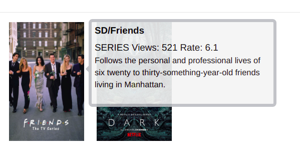

# Vue Tooltip
A simple tooltip where you can give position, header, subtitle and body.



## Installation
`$ npm i @beyzaerkan/vue-tooltip`

## Usage
```html
<Tooltip
  :text="{
  header:  '....',
  subtitle:  '....',
  body:  '....'
  }"
  position="...."
>
  tooltip
</Tooltip>
```

## Attributes

1.  **position**  - This is the position of the tooltip
	```
	position: right 
	position: left 
	position: top 
	position: bottom
	```
3.  **text**  - This is the content to be displayed in the tooltip
    ```
    text: {
	    header: String,
	    subtitle: String,
	    body: String
	}
    ```

## Example Vue Page

```html
<template>
  <div>
    <Tooltip
      :text="{
      header:  `${header}`,
      subtitle:  `${subtitle}`,
      body:  `${body}`
      }"
      position="...."
    >
    tooltip
    </Tooltip>
  </div>
</template>

<script>
export  default {
import Tooltip from "@beyzaerkan/vue-tooltip";
  
name:  "App",
components: {
    Tooltip,
  },
data() {
  return {
    header:  "....",
    subtitle:  "....",
    body:  "....",
    };
  },
};
</script>
```
